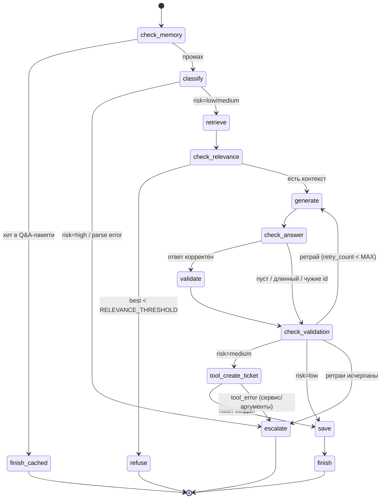

# DZ_7, кейс 1: ИИ-агент поддержки на LangGraph

Прикладной агент поддержки: принимает текстовый запрос пользователя, ищет
релевантную информацию в базе знаний (FAQ, **векторный поиск Qdrant** +
**RAG**), формирует **проверяемый ответ** со ссылками на источники
(`[источники: …]`), при **среднем риске** создаёт **тикет во внешней
тиккет-системе** (инструмент `create_ticket`, function calling) и
эскалирует. Оркестрация — **LangGraph** (`StateGraph`, 10 рабочих узлов +
4 терминала, 5 точек ветвления). Контрольный слой (метрики/лог/бюджет/
проверка ответа) — порт DZ_6.

## Требования задания → реализация

| Требование | Реализация |
|---|---|
| 1. Архитектура и цикл Reason→Act→Observe, 2 типа моделей, схема | Граф LangGraph (Reason=`classify`, Act=`retrieve`/`tool_create_ticket`/`generate`, Observe=`check_answer`/`validate`/`check_validation`); роутинг CHEAP/ADVANCED; mermaid-схема ниже |
| 2. Инструмент + function calling + SOP + ошибки | `create_ticket` (HTTP-сервис `ticket_server.py` на stdlib), вызов через `tools` (two-step JSON), `tool_schema.json` (draft-07, единый источник) + `validate_tool_call`, `SOP.md`, ретраи и эскалация `tool_error` |
| 3. Векторная память + RAG + retrieval-контроль | Qdrant-коллекция `dz7_case1` (порт DZ_4/DZ_6: `QdrantMemory`/`MockQdrantMemory`/`TfidfEmbedder`), порог `RELEVANCE_THRESHOLD`, Q&A-кэш (`check_memory`), retrieval-контроль в узле `retrieve` (второй проход top_k=6) |
| 4. Оркестрация 3–5 шагов + ветвление + SDK/LangGraph | `StateGraph`: 10 рабочих узлов, 5 точек ветвления (условные рёбра), `recursion_limit` + свой счётчик шагов в `trace` |
| 5. Метрики + лог + ограничение + проверка вывода | `RunMetrics` (время/вызовы/токены/`cost_rub`/модель/инструменты), `MeteredChat` (retry+backoff, общий бюджет двух моделей), `BudgetGuard`, `RunLog` (`logs/runs.jsonl` + ротация + `--report` + `[АЛЕРТ]`), `check_answer` + grounding-валидатор |

## Сценарий (вход → обработка → результат)

**Вход:** строка-запрос пользователя (`agent.py "вопрос"` / интерактив /
`--demo`).

**Обработка:** хит в Q&A-памяти? → классификация (категория/риск/сложность)
→ векторный поиск по БЗ (top-3, при пустом результате — второй проход
top-6) → порог релевантности → генерация ответа по контексту (CHEAP или
ADVANCED модель) → детерминированная `check_answer` → LLM-grounding-
валидатор → при `risk="medium"` — `create_ticket` → сохранение Q&A в память.

**Результат:** один из исходов —

- `answered` — ответ со списком источников `[doc_id]` + метрики прогона;
- `answered_cached` — ответ из Q&A-памяти **без LLM-вызовов**;
- `refused` — контекст нерелевантен (вежливый отказ, «не выдумывать»);
- `escalated` — с причиной: `ticket_created` (тикет создан, его id в ответе),
  `high_risk`, `classification_failed`, `answer_check_failed`,
  `grounding_validation_failed`, `budget_exceeded`, `max_steps`,
  `step_error:<узел>`, `tool_error:create_ticket: …`.

## Схема (граф LangGraph, 14 узлов)



Happy path: `check_memory → classify → retrieve → check_relevance → generate
→ check_answer → validate → check_validation → save → finish`. Любой узел,
упавший с исключением, маршрутизируется в `escalate` (свой счётчик `trace`
— второй гард после `recursion_limit` LangGraph).

## Структура

```
agent.py              # граф LangGraph, узлы, LLM-обвязка (2 модели), память,
                      # инструмент create_ticket, контрольный слой, CLI, selftest
ticket_server.py      # мок тикет-системы (stdlib http.server, data/tickets.json)
tool_schema.json      # draft-07 аргументов create_ticket (единый источник)
SOP.md                # операционная процедура инструмента create_ticket
context/kb.json       # база знаний: 12 FAQ-документов домена поддержки
memory/qa.json        # граф-память Q&A (заполняется при прогонах)
data/tickets.json     # тикеты (заполняет ticket_server.py)
logs/runs.jsonl       # лог выполнения (JSONL) — часть сдачи
docker-compose.yml    # Qdrant (Docker, порт 6333, коллекция dz7_case1)
requirements.txt      # pinned-зависимости
.env.example          # шаблон конфигурации
plan.md               # план реализации (история решения)
```

## Требования и установка

- Python 3.13 (разработано и проверено на 3.13.0).
- OpenAI-совместимый LLM-сервер (LM Studio, дефолт `http://localhost:1234/v1`)
  с чат-моделью (`CHEAP_MODEL`, `ADVANCED_MODEL`) и embedding-моделью
  (`EMBEDDING_MODEL`).
- Qdrant — Docker-контейнер на `localhost:6333`: `docker compose up -d`.
- Тикет-сервис: `.venv/bin/python ticket_server.py` (порт 8766).
- Если Qdrant или LLM недоступны — агент не падает: поиск деградирует до
  мок-памяти (детерминированные псевдо-векторы), сетевые ошибки LLM
  ретраятся, при исчерпании ретраев/бюджета — эскалация с причиной, а не
  traceback. Selftest работает вообще без LLM, Qdrant и сети.

```bash
cd case_1_support_agent
python3.13 -m venv .venv
.venv/bin/pip install -r requirements.txt
cp .env.example .env          # затем вписать модели из LM Studio
docker compose up -d          # Qdrant
.venv/bin/python ticket_server.py   # тикет-сервис (отдельный терминал)
```

## Запуск

```bash
# интерактивный режим (exit/quit/выход — выход; каждый прогон пишется в runs.jsonl)
.venv/bin/python agent.py

# один вопрос (+ строка метрик, запись в runs.jsonl)
.venv/bin/python agent.py "Как вернуть товар, если он не подошёл?"

# один вопрос с путём по узлам
.venv/bin/python agent.py --show-trace "Как вернуть товар, если он не подошёл?"

# сценарный прогон: 4 запроса, все ветки графа + сводная таблица метрик
.venv/bin/python agent.py --demo

# самодиагностика без LLM, Qdrant и сети (12 проверок)
.venv/bin/python agent.py --selftest

# агрегированные метрики по всему logs/runs.jsonl
.venv/bin/python agent.py --report
```

> Чтобы прогнать `--demo` с чистого листа: сбросьте `memory/qa.json` в
> `{"nodes": [], "edges": []}`, удалите `logs/runs.jsonl` и `data/tickets.json`.

## Пример выполнения

Ожидаемый формат живого прогона `--demo` (LM Studio + Qdrant +
`ticket_server.py`; текст ответов даёт живая модель, остальное —
детерминированно):

```text
Эмбеддинги: text-embedding-qwen3-embedding-0.6b (dim=1024)
Qdrant: dz7_case1 загружено (12 документов)
Агент DZ_7 кейс 1 | БЗ: 12 документов | память: 0 обработанных вопросов | модели: CHEAP=google/gemma-4-12b-qat, ADVANCED=google/gemma-4-12b-qat
Демо: 4 прогона (все ветки графа)

===== Прогон 1/4: happy path: полный путь + сохранение в память =====
Запрос: Как вернуть товар, если он не подошёл?
Путь по узлам: check_memory → classify → retrieve → check_relevance → generate → check_answer → validate → check_validation → save → finish
[answered]
Товар можно вернуть в течение 14 дней с момента получения, если он не был
в употреблении, сохранены упаковка и чек. Оформить возврат можно в личном
кабинете в разделе «Мои заказы» или в магазине. Возврат оформляется после
проверки товара, обычно в течение 3 рабочих дней.

[источники: doc-return]
Источники: doc-return, doc-exchange, doc-refund
Сохранено в память (qa.json).
Метрики: 42.10с | LLM-вызовов: 3 | токены: 1834 (prompt=902, completion=932) | стоимость: 0.0718₽ | ретраев: 0 | модель: ADVANCED

===== Прогон 2/4: нет контекста → ветка refuse =====
Запрос: Какая погода в Токио?
Путь по узлам: check_memory → classify → retrieve → check_relevance → refuse
[refused]
В базе знаний не нашлось релевантной информации. Попробуйте переформулировать вопрос или обратитесь к специалисту.
Метрики: 31.02с | LLM-вызовов: 1 | токены: 705 (prompt=209, completion=496) | стоимость: 0.0329₽ | ретраев: 0 | модель: CHEAP

===== Прогон 3/4: средний риск → инструмент create_ticket + тикет =====
Запрос: Возврат денег по заказу 4821 тянется две недели, менеджер меня игнорирует, готовлю претензию
Путь по узлам: check_memory → classify → retrieve → check_relevance → generate → check_answer → validate → check_validation → tool_create_ticket → save → finish
[escalated]
<ответ по контексту: сроки возврата средств, что делать>
Ваш запрос передан специалисту: тикет TKT-9F47AF8A.
Источники: doc-refund, doc-contacts
Сохранено в память (qa.json).
Причина: ticket_created
Метрики: 55.40с | LLM-вызовов: 4 | токены: 2210 (prompt=1180, completion=1030) | стоимость: 0.0882₽ | ретраев: 0 | модель: ADVANCED | инструментов: 1

===== Прогон 4/4: повтор вопроса 1 → хит в памяти =====
Запрос: Как вернуть товар, если он не подошёл?
Путь по узлам: check_memory → finish_cached
[answered_cached]
(ответ из памяти) Товар можно вернуть в течение 14 дней с момента получения…
Источники: doc-return, doc-exchange, doc-refund
Метрики: 0.00с | LLM-вызовов: 0 | токены: 0 (prompt=0, completion=0) | стоимость: 0.0000₽ | ретраев: 0

===== Сводка метрик =====
№   результат           LLM   токены     время   ретраи   стоимость  комментарий
1   answered              3     1834    42.10с        0     0.0718₽  happy path: полный путь + сохранение в память
2   refused               1      705    31.02с        0     0.0329₽  нет контекста → ветка refuse
3   escalated             4     2210    55.40с        0     0.0882₽  ticket_created
4   answered_cached       0        0     0.00с        0     0.0000₽  повтор вопроса 1 → хит в памяти
Успешность: 2/4 (50.0%) | отказов: 1 | ошибок: 1
Среднее время: 32.13с | суммарные токены: 4749 | стоимость: 0.1929₽ | ретраев: 0
[АЛЕРТ] 25.0% прогонов завершилось эскалацией (порог 20%) — проверьте LLM и конфигурацию
```

`[АЛЕРТ]` в демо ожидаем: прогон 3 — запланированная тикет-эскалация
(1/4 = 25% > порога 20%); по-настоящему «провалились» 0 прогонов. Та же
сводка — в `--report` по `logs/runs.jsonl`.

Деградация без LLM (проверено): `Метрики: … | LLM-вызовов: 3 | ретраев: 2`,
`[escalated]`, `Причина: step_error:classify` — эскалация вместо traceback.

## Инструмент `create_ticket`

- **Сервис:** `ticket_server.py` (stdlib `http.server`):
  `POST /tickets {title, priority, body}` → `{"ticket_id", "status"}`,
  `GET /health`; данные — `data/tickets.json` (append, атомарная запись).
- **Схема:** `tool_schema.json` (draft-07) — единый источник: передаётся
  LLM в `tools=[...]` **и** используется `validate_tool_call()`
  (имя функции, `additionalProperties:false`, enum
  `priority ∈ {low, normal, high, critical}`, длина `title`/`body`).
- **Интеграция:** two-step (надёжнее native tool-calling на локальных
  моделях): узел просит LLM вернуть JSON-вызов → валидация по схеме →
  HTTP-вызов. Невалидные аргументы → повтор с текстом ошибок
  (до `MAX_TOOL_STEPS`); сбой сервиса (таймаут: 2 ретрая 1с/2с; 5xx: без
  ретраев) → эскалация `tool_error:create_ticket`, тикет считается
  несозданным. Полная процедура — в `SOP.md`.

## Архитектура

```
CLI (agent.py): интерактив | "вопрос" | --demo | --selftest | --report | --show-trace
  |
  v
make_vector_memory(client, kb)
  |  LLM-эмбеддинги (embeddings.create) → QdrantMemory (cosine, dz7_case1)
  |  Qdrant недоступен → MockQdrantMemory (косинус в памяти, те же эмбеддинги)
  |  LLM недоступен → детерминированные псевдо-векторы (_random_embed)
  |
  v
MeteredChat(make_openai_chat(client, CHEAP_MODEL))          ← контрольный слой
  + MeteredChat(make_openai_chat(client, ADVANCED_MODEL), guard=общий)
  |  BudgetGuard (общий на обе модели): llm_calls < MAX_LLM_CALLS_PER_RUN,
  |  иначе BudgetExceeded; retry с backoff 0.5/1.5с на APIConnectionError/
  |  APITimeoutError; токены из usage (фолбэк len//4)
  |
  v
build_graph(Deps) → StateGraph(AgentState).compile()
  |  10 рабочих узлов: check_memory / classify / retrieve / check_relevance /
  |  generate / check_answer / validate / check_validation / tool_create_ticket / save
  |  4 терминала: finish / finish_cached / refuse / escalate
  |  5 точек ветвления + сквозной error-роутинг в escalate
  |  выбор модели в generate: CHEAP по умолчанию, ADVANCED при complexity=complex,
  |  слабом контексте (best < 2×порога) или перегенерации после провала
  |  гарды: recursion_limit (супершаги, запас +10) + свой счётчик trace (MAX_STEPS)
  |
  v
AgentResult + RunMetrics → RunLog (logs/runs.jsonl, JSONL, append,
                                      ротация → runs.jsonl.1 при переполнении)
                  + check_error_alert (доля эскалаций > порога → [АЛЕРТ])
```

Ключевые решения:

- **LangGraph — только граф-движок.** `langchain-openai` не используется:
  LLM-вызовы остаются на `openai`-клиенте через `ChatFn`/`MeteredChat`,
  узлы — обычные функции, возвращающие dict-дельту состояния. Это сохраняет
  offline-selftest и весь порт DZ_6 без переписывания.
- **Метрикация на шве LLM.** `MeteredChat` оборачивает любой `RawChatFn`
  (реальный клиент или FakeLLM); две модели делят один `BudgetGuard` и
  метрики — бюджет общий на прогон.
- **Две проверки ответа.** `check_answer` (детерминированная, без LLM):
  пустота, длина ≤ `MAX_ANSWER_CHARS`, источники из `[источники: …]`
  существуют в БЗ; затем LLM-валидатор grounding-фактов. Причины
  эскалации разные: `answer_check_failed` / `grounding_validation_failed`.
- **Тикет — только после проверок.** `create_ticket` вызывается, когда ответ
  уже прошёл обе проверки и `risk="medium"`; `risk="high"` эскалируется
  раньше (без тикета). Исход тикет-прогона — `escalated` (`ticket_created`),
  id тикета в ответе.
- **Лог — часть сдачи, с ротацией.** Каждый прогон дописывает одну
  JSON-строку в `logs/runs.jsonl` (ts, query, outcome, причина, trace,
  время, вызовы, токены, `cost_rub`, ретраи, `model_used`, `tool_calls`,
  `tool_retries`, memory_saved, sources); при переполнении (`RUNS_LOG_MAX_RECORDS`)
  файл уходит в `runs.jsonl.1`. Selftest пишет только в tmp.
- **Selftest без инфраструктуры.** `FakeLLM` (режимы `default`/`risky`/
  `medium`/`ungrounded`/`loop`/`flaky`/`badformat`/`tool_bad`) +
  `MockQdrantMemory` с TF-IDF + in-process мок тикет-сервиса на эфемерном
  порту: все ветки графа, бюджет, retry, check_answer и тикет-инструмент
  проверяются без LLM, Qdrant и сети.

## Конфигурация (`.env`)

| Переменная | Дефолт | Назначение |
|---|---|---|
| `LLM_BASE_URL` | `http://localhost:1234/v1` | адрес OpenAI-совместимого сервера |
| `LLM_API_KEY` | `lm-studio` | ключ (для LM Studio — любое непустое) |
| `CHEAP_MODEL` | `google/gemma-4-12b-qat` | модель классификации/валидатора/типовых ответов |
| `ADVANCED_MODEL` | `google/gemma-4-12b-qat` | модель сложной генерации и перегенерации |
| `LLM_REQUEST_TIMEOUT_SECONDS` | `120` | таймаут запроса к LLM |
| `EMBEDDING_MODEL` | `text-embedding-qwen3-embedding-0.6b` | Model Identifier embedding-модели |
| `EMBEDDING_DIM` | `1024` | размерность вектора (должна совпадать с моделью и коллекцией) |
| `QDRANT_URL` | `http://localhost:6333` | адрес Qdrant |
| `QDRANT_COLLECTION` | `dz7_case1` | имя коллекции (создаётся автоматически, cosine) |
| `KB_FILE` | `context/kb.json` | база знаний (FAQ-документы) |
| `QA_MEMORY_FILE` | `memory/qa.json` | граф-память Q&A |
| `TICKET_API_URL` | `http://127.0.0.1:8766` | адрес мок-тикет-сервиса |
| `TICKET_TIMEOUT_SECONDS` | `5` | таймаут запроса к тикет-сервису |
| `MAX_TOOL_STEPS` | `4` | жёсткий лимит LLM-вызовов на аргументы `create_ticket` |
| `RELEVANCE_THRESHOLD` | `0.3` | порог косинусного сходства (ниже — refuse) |
| `MEMORY_HIT_THRESHOLD` | `1.5` | порог keyword-совпадения с вопросом из памяти (не опускать) |
| `MAX_VALIDATION_RETRIES` | `2` | перегенерации после провала проверки/валидации |
| `MAX_STEPS` | `15` | гард: максимум состояний за один прогон |
| `MAX_LLM_CALLS_PER_RUN` | `6` | предохранитель: максимум LLM-вызовов за прогон |
| `LLM_MAX_RETRIES` | `2` | retry с backoff на сетевые ошибки LLM |
| `MAX_ANSWER_CHARS` | `2000` | лимит длины ответа для `check_answer` |
| `RUNS_LOG_FILE` | `logs/runs.jsonl` | файл лога выполнения (JSONL) |
| `RUNS_LOG_MAX_RECORDS` | `1000` | ротация лога: при переполнении файл → `<файл>.1`; 0 — выключена |
| `LLM_COST_INPUT_PER_1M_RUB` | `15` | тариф за 1M входных токенов (₽) для метрики `cost_rub` |
| `LLM_COST_OUTPUT_PER_1M_RUB` | `60` | тариф за 1M выходных токенов (₽) для метрики `cost_rub` |
| `ERROR_ALERT_THRESHOLD` | `0.2` | порог доли эскалаций: выше — `[АЛЕРТ]` в `--demo`/`--report` |
| `LOG_LEVEL` | `ERROR` | уровень логирования |

## Selftest (без LLM и Qdrant)

`.venv/bin/python agent.py --selftest` — 12 проверок, LLM-сервер, Qdrant и
сеть **не нужны** (FakeLLM + мок Qdrant + TF-IDF-эмбеддер + in-process мок
тикет-сервиса):

1. граф собирается (`draw_ascii()` не падает), все 14 узлов достижимы,
   переходов в «фантазии» нет;
2. честный путь `answered`: полный trace, `[источники]` из БЗ, qa.json
   записан, ребро `qa → doc-return`, стоимость посчитана;
3. ветка «нет контекста»: `refuse`, память не пополняется;
4. высокий риск: `escalate high_risk` детерминированно, без генерации;
5. `check_answer` ловит выдуманный `[doc_id]` → ретраи →
   `answer_check_failed`, LLM-валидатор не вызывается;
6. `finish_cached`: повторный вопрос без LLM-вызовов (`llm_calls == 0`);
7. цикл `generate→check_answer→check_validation→generate` гасится
   `MAX_STEPS` (свой счётчик trace);
8. бюджет: `BudgetExceeded` → `budget_exceeded`, ровно 4 LLM-вызова, запись
   в tmp-лог;
9. `MeteredChat` retry на `flaky` (2 сетевые ошибки → успех, retries=2);
10. тикет-инструмент: невалидные аргументы LLM → повтор с ошибками →
     валидный тикет в tmp-файле; сервис down → `tool_error` + эскалация
     (не падение); HTTP 5xx → `tool_error` сразу, без ретраев;
11. `RunLog`: запись + ротация во временном каталоге;
12. `--report`: агрегаты и `[АЛЕРТ]` по tmp-логу.

Успех = `SELF-TEST: все проверки пройдены.` и код возврата 0.
